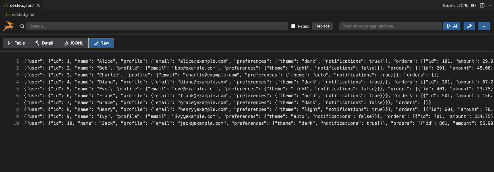

# JSONL Gazelle

<div align="center">
  
</div>

A fast JSONL viewer / editor for VS Code with advanced features including table view, item view, JSON pretty print view, search, and AI. JSONL (JSON Lines) is increasingly important for machine learning datasets, log analysis, data streaming, and LLM training - unlike regular JSON, it can be processed line-by-line making it perfect for large datasets.




## Features

- **Fast Table View**: Automatically detects common JSON paths and displays them as table columns
- **Smart Column Detection**: Maps common subpaths of each JSONL row into table columns automatically
- **Column Expansion**: Click ▼ to expand objects/arrays into separate columns (e.g., `user.name`, `orders[0]`)
- **Column Management**: Right-click context menu on table headers to add, remove, or toggle column visibility
- **Advanced Search**: Fast search with regex support and magnifying glass icon (🔍)
- **Find & Replace**: Replace functionality with and without regex patterns
- **AI Integration**: OpenAI API integration with field reference syntax `{{fieldname.subname[0]}}`
- **CSV Export**: Export tables to CSV with all JSON paths flattened
- **Indexing State**: Shows Gazelle icon during file loading/indexing
- **Memory Efficient**: All processing happens in memory without creating separate files

## Usage

1. Open any `.jsonl` file in VS Code
2. The file will automatically open in the JSONL Gazelle viewer
3. Use the search bar to filter rows (with regex support)
4. Click ▼ buttons in column headers to expand objects/arrays into separate columns
5. Right-click column headers to manage columns
6. Set your OpenAI API key in settings for AI features
7. Ask questions about specific rows using the AI input field
8. Export filtered results to CSV

## Column Expansion

JSONL Gazelle automatically detects when columns contain objects or arrays and provides expand/collapse functionality:

- **Expand**: Click ▼ to expand a column containing objects/arrays
  - Objects become separate columns: `user.name`, `user.profile.email`
  - Arrays become indexed columns: `orders[0]`, `orders[1]`, etc.
- **Collapse**: Click ▶ to collapse expanded columns back to the original column
- **Nested Expansion**: Sub-columns can be further expanded if they contain objects/arrays

## AI Field References

Use the following syntax in your AI questions to reference specific fields:

- `{{name}}` - Reference the name field
- `{{address.city}}` - Reference nested fields
- `{{hobbies[0]}}` - Reference array elements

Example: "What is the average age of users who live in {{address.city}}?"

## Keyboard Shortcuts

- **Ctrl/Cmd + F**: Focus search input
- **Ctrl/Cmd + R**: Focus replace input
- **Right-click**: Open column context menu

## Installation

1. Clone this repository
2. Run `npm install` to install dependencies
3. Run `npm run compile` to build the extension
4. Press F5 to run the extension in a new Extension Development Host window

## Development

```bash
# Install dependencies
npm install

# Compile TypeScript
npm run compile

# Watch for changes
npm run watch
```

## Test Data Generation

For testing with large datasets, you can generate a comprehensive test file with 10,000 lines (~64MB) containing varied fields and nested structures:

```bash
# Generate large test data file
cd test-data
node generate-large.js
```

This will create `test-data/large.jsonl` with:
- **User profiles** with nested addresses, preferences, and social media links
- **Orders** with items, pricing, shipping, and tracking information  
- **Analytics data** with metrics, device info, and campaign details
- **Log entries** with request details, performance metrics, and error information
- **Mixed data types**: strings, numbers, booleans, arrays, objects
- **Nested structures** up to 4-5 levels deep

The generated file is automatically excluded from git via `.gitignore` to keep the repository lightweight.

## What's next / Roadmap

- [X] Basic plugin working
- [X] Improve UI for nested JSON (column expansion functionality)
- [ ] Table view: Improving loading performance for large.jsonl (which you can generate as above)
- [ ] Table view: Improve table view performance for large.jsonl
- [ ] Table view: Allow wrapping text
- [ ] Table view: Row deletion and addition
- [ ] Table view: Column deletion and addition
- [ ] Table view: Synthesize new rows from existing rows via AI
- [ ] Table view: Test and refine adding new columns by running LLM on each
- [ ] JSONL view: rename to "Pretty Print"
- [ ] Pretty print view: Allow edits
- [ ] Pretty print view: Allow moving to the same row in Table view, and vice versa
- [ ] All views: Better search highlighting

## License

MIT License. See [LICENSE](LICENSE) file for details.
