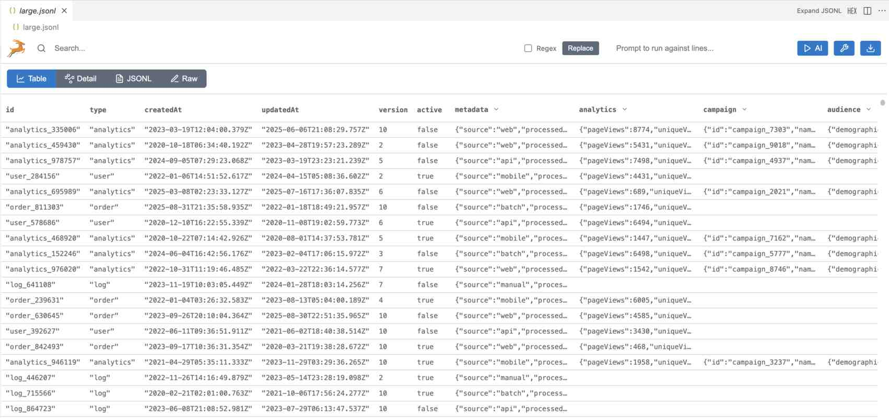
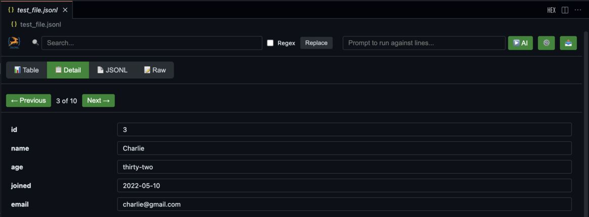
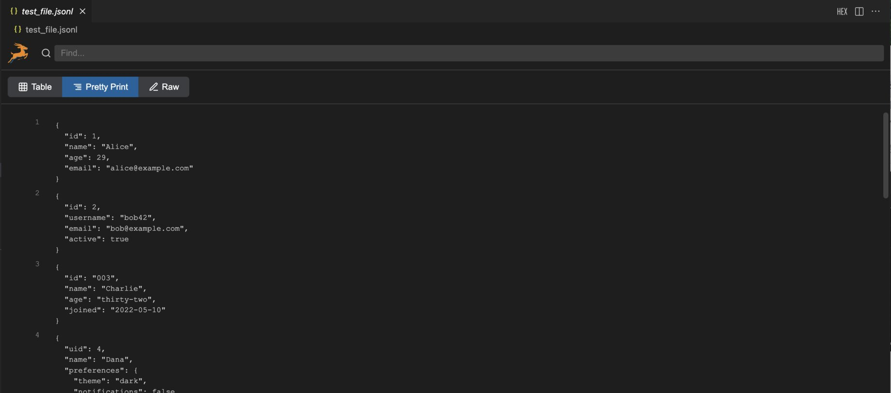
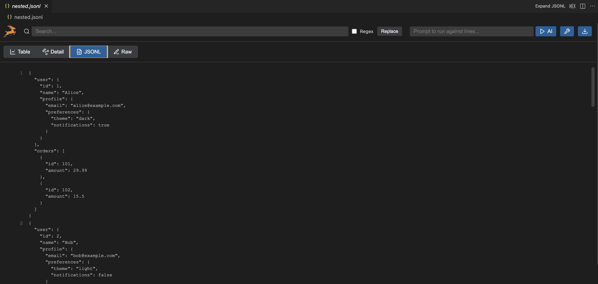

# JSONL Gazelle

<div align="center">
  
</div>

Fast JSONL viewer / editor for VS Code with advanced features including Table View and Pretty Print view. JSONL (JSON Lines) is increasingly important for machine learning datasets, log analysis, data streaming, and LLM training. Unlike regular JSON, it can be processed line-by-line making it perfect for large datasets.









## What's new

- *v0.4.3*: Line-by-line navigation in Raw and Pretty print mode, fixed small bugs, updated models.
- *v0.4.2*: Fixed AI settings persistence so model/system prompt changes are saved even when the API key remains unchanged.
- *v0.4.1*: Improved editing reliability with row/insertion ordering fixes, safer autosave behavior, and less intrusive rating prompts.
- *v0.4.0*: Added AI-powered column suggestions from the context menu, manual column insertion improvements, and row filtering mapping tests.
- *v0.3.4*: Improved AI settings flow when API keys are missing, plus dialog polish and stability fixes.
- *v0.3.1*: Added a **Split into Parts (100MB+)** command in the file context menu for very large JSONL files.
- *v0.3.0*: Added a substantially improved Pretty Print view with syntax highlighting.
- *UX updates*: Added support for light themes and documented keyboard shortcuts for Pretty Print entry navigation (`Ctrl+Alt+↑/↓`, or `Cmd+Option+↑/↓` on macOS) plus line move shortcuts (`Alt+↑/↓`, or `Option+↑/↓` on macOS).

## Features

- **Fast Table View**: Automatically detects common JSON paths and displays them as table columns
- **Smart Column Detection**: Maps common subpaths of each JSONL row into table columns automatically
- **Column Expansion**: Click ▼ to expand objects/arrays into separate columns (e.g., `user.name`, `orders[0]`)
- **Column Management**: Right-click context menu on table headers to add, remove, or toggle column visibility
- **Memory Efficient**: All processing happens in-memory without creating separate files

## Usage

1. Open any `.jsonl` file in VS Code
2. The file will automatically open in the JSONL Gazelle viewer
4. Table View: Click ▼ buttons in column headers or double-click expandable cells to expand objects/arrays into separate columns
5. Pretty Print view: You can edit inline
6. Pretty Print navigation: Use `Ctrl+Alt+↑` / `Ctrl+Alt+↓` (`Cmd+Option+↑` / `Cmd+Option+↓` on macOS) to jump between JSONL entries
7. Raw view navigation: Use `Ctrl+Alt+↑` / `Ctrl+Alt+↓` (`Cmd+Option+↑` / `Cmd+Option+↓` on macOS) to jump to the previous/next JSONL line
8. Move current line: Use `Alt+↑` / `Alt+↓` (`Option+↑` / `Option+↓` on macOS) to move the current line up or down in the editor

## Extension Development

1. Clone this repository
2. Run `npm install` to install dependencies
3. Run `npm run compile` to build the extension
4. Press F5 to run the extension in a new Extension Development Host window

## Test Data Generation

For testing with large datasets, you can generate a comprehensive test file with 45,000 lines (~64MB) containing varied fields and nested structures:

```bash
# Generate large test data file
cd test-data
node generate-large.js
```

This will create `test-data/large.jsonl` with:
- **User profiles** with nested addresses, preferences, and social media links
- **Orders** with items, pricing, shipping, and tracking information  
- **Analytics data** with metrics, device info, and campaign details
- **Log entries** with request details, performance metrics, and error information
- **Mixed data types**: strings, numbers, booleans, arrays, objects
- **Nested structures** up to 4-5 levels deep

The generated file is automatically excluded from git via `.gitignore` to keep the repository lightweight.

## What's next / Roadmap
- [ ] Expand export options beyond CSV (e.g., JSON array, Parquet, or Avro) for analytics/data engineering workflows.
- [ ] Add configurable AI provider support (Anthropic/Google Gemini/local endpoints) in addition to OpenAI.

## License

MIT License. See [LICENSE](LICENSE) file for details.
