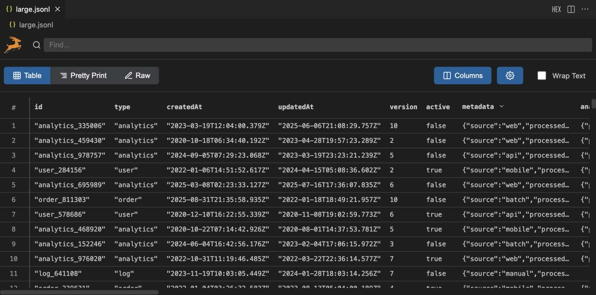
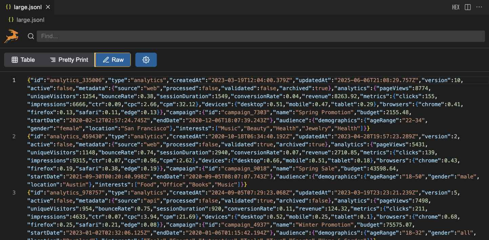

# JSONL Gazelle

<div align="center">
  
</div>

Fast JSONL viewer / editor for VS Code with advanced features including Table View and Pretty Print view. JSONL (JSON Lines) is increasingly important for machine learning datasets, log analysis, data streaming, and LLM training. Unlike regular JSON, it can be processed line-by-line making it perfect for large datasets.







## Features

- **Fast Table View**: Automatically detects common JSON paths and displays them as table columns
- **Smart Column Detection**: Maps common subpaths of each JSONL row into table columns automatically
- **Column Expansion**: Click ▼ to expand objects/arrays into separate columns (e.g., `user.name`, `orders[0]`)
- **Column Management**: Right-click context menu on table headers to add, remove, or toggle column visibility
- **Memory Efficient**: All processing happens in-memory without creating separate files

## Usage

1. Open any `.jsonl` file in VS Code
2. The file will automatically open in the JSONL Gazelle viewer
4. Table View: Click ▼ buttons in column headers or double-click expandable cells to expand objects/arrays into separate columns
5. Pretty Print view: You can edit inline

## Extension Development

1. Clone this repository
2. Run `npm install` to install dependencies
3. Run `npm run compile` to build the extension
4. Press F5 to run the extension in a new Extension Development Host window

## Development

```bash
# Install dependencies
npm install

# Compile TypeScript
npm run compile

# Watch for changes
npm run watch
```

## Test Data Generation

For testing with large datasets, you can generate a comprehensive test file with 10,000 lines (~64MB) containing varied fields and nested structures:

```bash
# Generate large test data file
cd test-data
node generate-large.js
```

This will create `test-data/large.jsonl` with:
- **User profiles** with nested addresses, preferences, and social media links
- **Orders** with items, pricing, shipping, and tracking information  
- **Analytics data** with metrics, device info, and campaign details
- **Log entries** with request details, performance metrics, and error information
- **Mixed data types**: strings, numbers, booleans, arrays, objects
- **Nested structures** up to 4-5 levels deep

The generated file is automatically excluded from git via `.gitignore` to keep the repository lightweight.

## What's next / Roadmap
- [ ] Table view: Improving loading performance for large files such as large.jsonl (which you can generate per the instructions above). Might want to implement a buffering approach: Only load what's visible and a bit more. Maybe keep an index of where in the original file each line starts?
- [ ] Table view: Allow wrapping text - add a checkbox in the top bar, and if it's checked, the line contents should wrap
- [ ] Table view: Row deletion and addition - this should be on right-click on the row header, allow Delete, Insert above, and insert below
- [ ] Table view: Allow hiding columns (and unhiding them) like Google Sheets - make sure there's an indicator that allows me to un-hide
- [ ] Table view: Column deletion and addition - this should be a right-click on the column header, allow Delete, Insert before, insert after, 
- [ ] Table view: Insert column with AI: Pull up a prompt dialog, let me define how it should be filled by using `{{row}}` or `{{row.fieldname[index]}}` type notation. Then parallelize the filling of the newly created column, show a progress bar
- [ ] Table view: Insert rows with AI: Right-click on the row header, then choose how many of the previous rows to feed it (default to 10), and a prompt dialog that defaults to "generate more like these, but make it different from the lines below"
- [ ] Settings: A settings dialog to enter your OpenAI key and select a model (default to gpt-4.1-mini) for the above AI features
- [ ] Pretty print view: Link to view the same row in Table view, and vice versa
- [ ] Raw view: Line numbers and JSON syntax highlighting
- [ ] Find / Replace: Implement great Find / Replace / Replace All with Regex option and highlighting

## License

MIT License. See [LICENSE](LICENSE) file for details.
